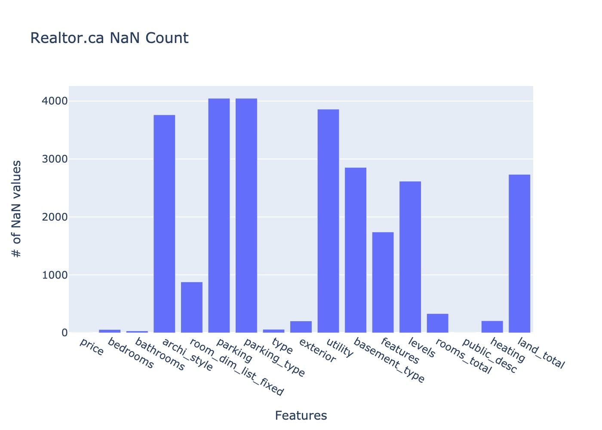
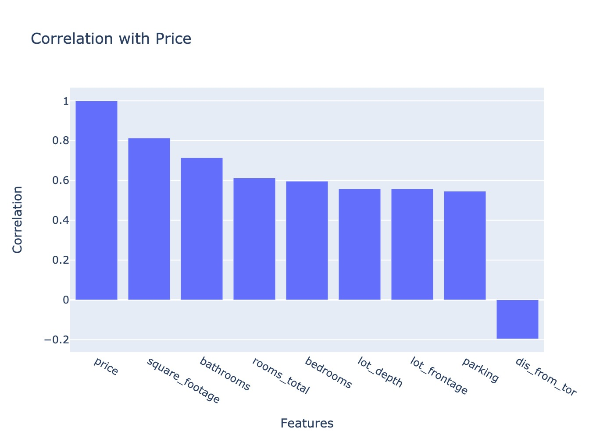
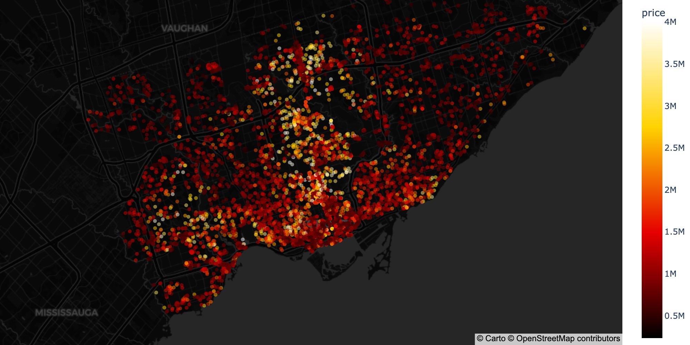
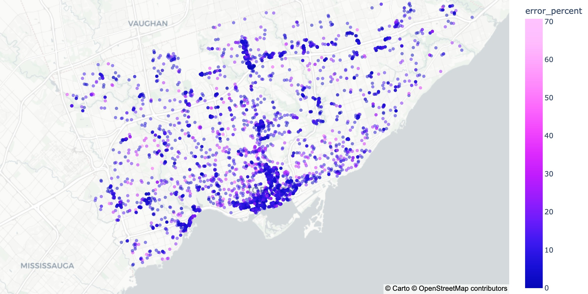
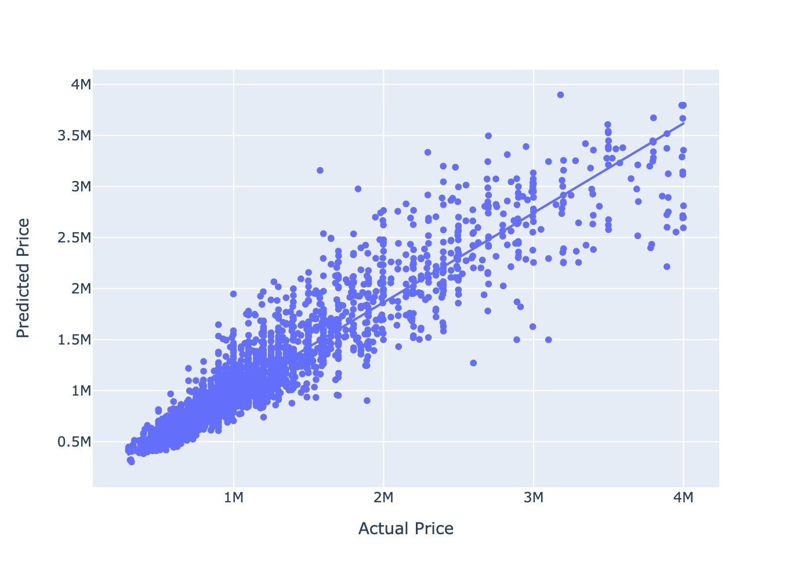

# Toronto Realestate Scraping and Analysis
Analysis and analytics on the Toronto Real Estate Market using python, Regression modeling and webscrapers

## Included in this README:

1. Using the Scraper
2. Summary of Analysis + Looking Forward
3. Notes on Scrapers

## Using the Scraper

To use the Zoocasa scraper, just CD in the "realtor" folder and then ```docker-compose up``` with the ```--build``` tag if this is the first time running.

There are a few options you can change in the spider at the beginning of the class declaration (./realestate/realestate/spiders/zoocasa.py) if you wish and they are listed below:

1. status - "available" or "not-available-sold", the former will scrape all available (on the market) listings, and the latter will scrape all obtainable sold listings.

2. slug - default: "toronto-on", there are many possible values for this one. You can find them in the urls of Zoocasa search pages. ex. "ontario" scrapes all Ontario listings.

3. complex_scrape - bool default: False, this determines whether or not the scraper will send requests to each listing page with the API or if it will just send requests to the search page. If true, the scraping process will take much longer, but will gather more info such as, type, heating, air conditioning, neighbourhood, driveway, basement, levels, total rooms, room dimensions etc. The full list is in the parse_listing function in the scraper.

The full analysis on the scraped data and model creation are in the toronto-realestate.ipynb

## Summary of Analysis

I ended up using the Zoocasa data for a couple reasons. One being that the TRREB scraped data was not nearly as large as the other Realtor.ca or Zoocasa. Another one being that Zoocasa has the least NaN values for important data.




The final Zoocasa dataset has 18530 rows and 41 columns. Most of these being potential features with the exclusion of MLS number and Zoocasa ID.

After cleaning the data (which is all outlined in the Juptyer Notebook), I took a look at the correlation between price and some of the numerical features.



We can see that the greatest correlation with price is square footage, followed by # of bathrooms. The only negative correlation is distance from centre of Toronto (Yonge and Eglinton). For most waterfront cities, I would also want to include proximity to water. But Toronto is unique in that its waterfront properties and communities are less developed than other comparable cities. It would be interesting to see how this changes overtime.

I attempted creating some models on the data and used the R-squared score with K-Fold cross validation to compare models. The linear regression model had 0.80 R-squared, the Random Forest regression model had 0.84 R-squared and the XGBoost regression model had 0.86 R-squared. I also noticed that removing the total rooms actually improved the R^2. This could be due to errors in the dataset or that the total rooms doesn't actually really affect the price. Either way the number of rooms is already accounted for with the total square footage.

### Tuning the model

I explored possibly using date as a feature but with no improvement. So I moved into looking to ways I could improve the location.



The lighter the point, the higher the price of the listing. We can see a trend here, the closer to yonge st is where we see the higher priced listings. Also there is much higher density of points in downtown Toronto versus other regions such as Scarborough, Etobicoke and the Beaches.

Looking at this map is how I got the idea to add distance from centre of Toronto as a feature in the model.

I also added the Uber Hexagons as a categorical variable to the dataset instead FSA. We can choose the resolution of hexagons to change how many total features we have.

https://www.uber.com/en-CA/blog/h3/

The best combination in terms of R-squared score is including the distance from Toronto and Uber hexagons with resolution of 6.

The final step I performed was hyperparameter tuning for the XGBoost model. I just chose some basic parameters for the XGBoost Regressor to see which is best on the dataset.

The best hyperparameters are 

```{'colsample_bytree': 0.7, 'learning_rate': 0.1, 'max_depth': 6, 'n_estimators': 1000}```

With the hyperparameter tuning we were able to reach an R2 score of 90.3%, a mean absolute error of $99 564, a root mean squared error of $174 813 and mean absolute percentage error of 9.4%



This is a map of the error comparing the predicted prices to the actual prices. The more pink/purple the dot is, the higher percent of error the with the model prediction. The key insight about the model that we can take away is that our model is predicting wrong in areas with less data than others. So, probably, for further improvement, we would need more data points. 



This is a scatter plot for the final model, with the predicted test prices vs the actual test prices. We can see that as the price increases over about the 2 mil region, the model points get further from the trendline. There are significantly more lower cost, condos in the dataset than houses. Possibly only including condos or setting a lower price cap of 2 mil would yield greater results.

Below is a table of statistical inference from the XGBoost regression.

<table border="1" class="dataframe">
  <thead>
    <tr style="text-align: right;">
      <th></th>
      <th>0</th>
      <th>1</th>
    </tr>
  </thead>
  <tbody>
    <tr>
      <th>4</th>
      <td>lat</td>
      <td>8485.0</td>
    </tr>
    <tr>
      <th>5</th>
      <td>lon</td>
      <td>7811.0</td>
    </tr>
    <tr>
      <th>6</th>
      <td>dis_from_tor</td>
      <td>6963.0</td>
    </tr>
    <tr>
      <th>0</th>
      <td>bedrooms</td>
      <td>5041.0</td>
    </tr>
    <tr>
      <th>2</th>
      <td>square_footage</td>
      <td>4941.0</td>
    </tr>
    <tr>
      <th>3</th>
      <td>parking</td>
      <td>2292.0</td>
    </tr>
    <tr>
      <th>1</th>
      <td>bathrooms</td>
      <td>2270.0</td>
    </tr>
    <tr>
      <th>12</th>
      <td>levels_2-Storey</td>
      <td>407.0</td>
    </tr>
    <tr>
      <th>9</th>
      <td>type_Detached</td>
      <td>304.0</td>
    </tr>
    <tr>
      <th>7</th>
      <td>type_Condo Apt</td>
      <td>278.0</td>
    </tr>
  </tbody>
</table>

In terms of statistical inference, the classic realtor motto is re-affirmed in that location is the most important feature when it comes to housing. The first three most important features are to do with location and followed by square footage, then number of bedrooms, then parking, then number of bathrooms. With the actual type of the property being behind all three of these factors.

## Looking forward

There are lots of things that I couldn't get from the scraper, either because not enough listings provided that data, or the site didn't allow for it. Things like renovations, age of building, and other amenities that come along with a condo affect the price. Whether or not it comes furnished. There is a column that I scraped with the descriptions and extras for each listing. A possible way of improvement could be to use NLP to extract keywords for those and then add that in as a categorical feature for the model.

We also have a list of room dimensions, exterior, basement type and garage type. But as shown earlier I had some trouble with cutting these categories down into succinct groups. Other than that, we probably just need more data to get better results. It would be possible to run this scraper every year and then you would have a fuller dataset to train your model with. But over time you would need to better account for the date than I did here


## Scraping Notes:

Attempted Data Sources:

1. Remax - Unfinished
2. Realtor.ca - spider not included
3. Zillow - Unfinished
4. Zoocasa
5. Trreb - spider not included

### Zoocasa.com

This scraper was quite difficult to develop, the method I used is one that I find to be effective when scraping sites with JS pagination. I request directly to the API for the JSON data which includes the listings per page, and then request directly to each listing link for further features which are not displayed on the listings search page. All the scrapers follow this similar pattern.

Scraping Stats:
- No Download Delay
- ~7 min to scrape
- 3856 items
- 1 KeyError
- 139 POST Reqs
- 3857 GET Reqs

Complex Stats:
Scraping Stats v2 (Available):
- No Download Delay
- ~10.5 min to scrape (On Brainstation Wifi)
- 4003 items
- 1 500 Internal Server Error
- 145 POST Reqs
- 4006 GET Reqs

Scraping Stats v2 (Sold):
- No Download Delay
- ~71 min to scrape
- 24195 items
- 16 Timeout Server Errors
- 9 500 Internal Server Error
- 869 POST Reqs
- 24220 GET Reqs

Not Complex:
Scraping Stats v2 (Available):
- No Download Delay
- ~38s to scrape
- 4067 items
- 18 POST Reqs

### Realtor.ca

This site had a lot of protections from bots and scrapers. The actual site couldn't be sent any requests without JS enabled with being intercepted by Incapsula. So a lot of workarounds had to be used so that the scraper was only using Realtor.ca's API. This actually made the scraper a lot faster, due to working solely with JSON reqs.

Scraping Stats:
- No Download Delay
- ~2 min to scrape
- 4046 items
- 22 POST Reqs
- 4046 GET Reqs

### Trreb.ca

This site was by far the easiest to scrape. It was scraped purely using the API, which was fairly unprotected. Although it has the least amount of detail and lowest listing count

Scraping Stats:
- No Download Delay
- 47 sec to scrape
- 1495 items
- 1497 GET Reqs
